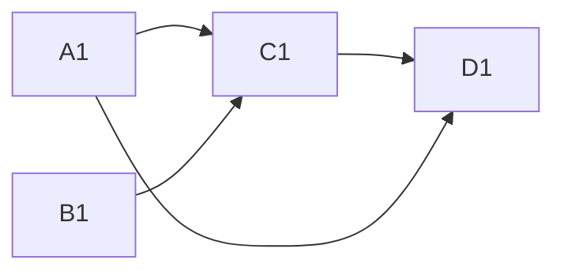
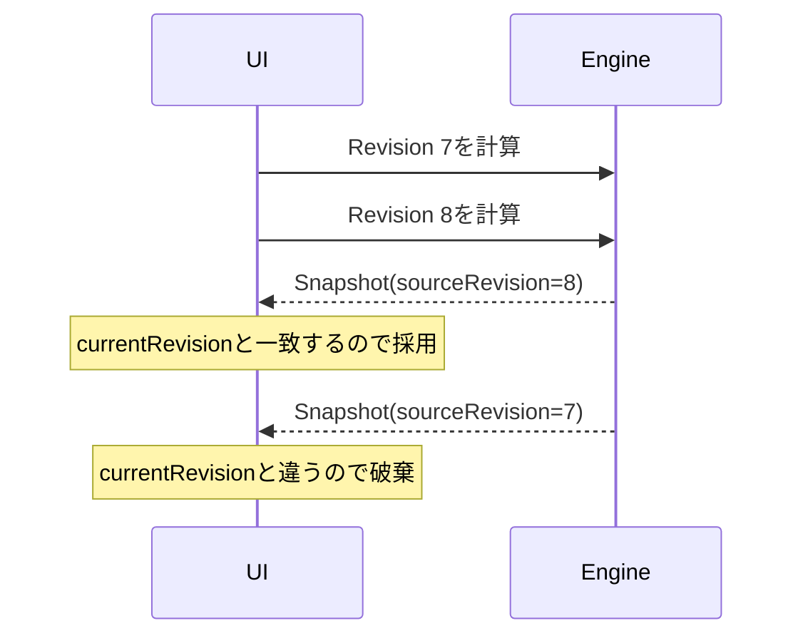

# 0. スプレッドシートは小さなプログラム

## 画面に見えているものと、内部で起きていること

スプレッドシートを開くと、行と列に区切られたセルが見えます。そのため、最初は次のようなアプリに見えます。

```text
A1という箱に100を保存する
B1という箱に40を保存する
C1という箱に60を保存する
```

しかしC1へ`=A1-B1`と入力した瞬間、C1は単なる箱ではなくなります。

```text
A1 = 100
B1 = 40
C1 = A1 - B1
D1 = C1 / A1
```

これは次のプログラムとほぼ同じです。

```ts
const A1 = 100;
const B1 = 40;
const C1 = A1 - B1;
const D1 = C1 / A1;
```

違いは、利用者が実行中にA1やFormulaを書き換えられることです。書き換えのたびに、影響を受ける部分だけを正しい順序で再実行しなければなりません。

表計算エンジンとは、この「編集可能な小さなプログラム」を管理する実行系です。

## まず素朴に作ってみる

最小のCellを次のように考えてみます。

```ts
type Cell = {
  input: string;
  value: number | string;
};
```

A1が編集されたら、A1の`value`を変えればよさそうです。しかし、すぐに問題が出ます。

### 問題1: C1とD1をいつ更新するのか

A1を100から120へ変更します。

```text
変更前: A1=100, C1=60, D1=0.6
変更途中: A1=120, C1=60, D1=0.6
変更後: A1=120, C1=80, D1=0.666...
```

変更途中には、新しいA1と古いC1・D1が混ざっています。この状態を画面や別のFormulaから読めると、Workbook全体として整合しません。

### 問題2: D1とC1のどちらを先に計算するのか

D1はC1を参照しています。A1を変更したあと、D1を先に計算すると古いC1を使います。

```text
誤った順番: D1 → C1
正しい順番: C1 → D1
```

Formulaを入力された順やCellの座標順に評価しても、依存関係と一致する保証はありません。

### 問題3: どこまで再計算するのか

100万個のFormulaがあるとき、A1の編集ごとに全Formulaを計算すれば正しさは保てますが、操作が重くなります。一方、A1だけを更新するとC1とD1が古いままです。

必要なのは、A1から影響を受けるCellを推移的に見つけることです。

### 問題4: Formulaが壊れていたらどうするのか

C1へ`=A1-`と入力した場合、入力を拒否して消してしまうと、利用者は修正できません。アプリ全体を例外で止めてもいけません。

壊れたFormulaSourceを保存しつつ、そのCellValueだけを`#PARSE!`にする必要があります。

### 問題5: 計算中に次の編集が来たらどうするのか

計算が非同期だと、次の順番が起こり得ます。

```text
Revision 7の計算開始
Revision 8を作る編集
Revision 8の計算完了
Revision 7の遅い計算完了
```

最後に完了した結果を無条件で表示すると、画面がRevision 7へ巻き戻ります。計算結果が「どの入力版の結果か」を持つ必要があります。

### 問題6: 複数セル貼り付けの途中で失敗したらどうするのか

2×2の貼り付けをCellごとに保存すると、2個保存したところで失敗し、半分だけ更新されたWorkbookが残る可能性があります。

1回の利用者操作を、分割できない1つの変更として扱う必要があります。

## 必要な4つの機械

問題を整理すると、表計算エンジンは4つの責務に分かれます。


### 1. Editor

利用者の操作を文字入力の列ではなく、意味のある変更単位へまとめます。

```text
「A1:D4を貼り付けた」
  = 16回の無関係な更新ではない
  = 1つのWorkbookChangeSet
```

### 2. Versioned Store

ChangeSetを原子的に適用し、新しいWorkbookRevisionを作ります。

```text
Revision 0 --ChangeSet--> Revision 1
```

Revisionは「いつの入力か」を識別します。計算途中の一時状態ではありません。

### 3. Formula Compiler

FormulaSourceをTokenとASTへ変換し、どのCellがどのCellを参照しているかを抽出します。

```text
=A1-B1
  ↓ parse
binary(-, reference(A1), reference(B1))
  ↓ dependency extraction
Precedents: A1, B1
```

### 4. Calculation Runtime

変更CellからDependentを辿り、DirtyCellを決めます。循環参照を検出し、残りをPrecedentから順に評価してCalculationSnapshotを作ります。

## Compilerやbuild systemとして考える

表計算エンジンは、build systemと対応づけると理解しやすくなります。

| Spreadsheet | Compiler / build system |
| --- | --- |
| FormulaSource | source code |
| Token / AST | parsed representation |
| CellReference | module dependency |
| DependencyGraph | build dependency graph |
| DirtyCell | rebuildが必要なtarget |
| evaluationOrder | build order |
| CellValue | build output |
| CalculationSnapshot | 1回の整合したbuild結果 |

ソースコードを変更すると、そのsourceに依存するtargetだけをbuildし直します。Spreadsheetでも同じ問題を解いています。

## 具体例を内部状態で追う

最初の入力をRevision 0とします。

```text
WorkbookRevision 0
├── A1: Literal(100)
├── B1: Literal(40)
├── C1: Formula("=A1-B1")
└── D1: Formula("=C1/A1")
```

CompilerはFormulaを解析し、次のGraphを作ります。



RuntimeはPrecedentから評価します。

```text
evaluationOrder: C1 → D1

CalculationSnapshot(sourceRevision = 0)
├── A1: Number(100)
├── B1: Number(40)
├── C1: Number(60)
└── D1: Number(0.6)
```

ここでA1を120へ変更します。

```text
WorkbookChangeSet
├── baseRevision: 0
└── A1: Literal(120)
```

StoreはRevision 1を作ります。Revision 0そのものを計算途中で書き換えるのではありません。

```text
WorkbookRevision 1
├── A1: Literal(120)        ← changed
├── B1: Literal(40)
├── C1: Formula("=A1-B1")
└── D1: Formula("=C1/A1")
```

前後のCellContentを比較するとchangedはA1です。GraphのDependentを辿ると、Dirty closureはA1、C1、D1になります。

```text
changed: A1
dirty: A1, C1, D1
evaluationOrder: C1 → D1
```

新しいSnapshotは一度に完成します。

```text
CalculationSnapshot(sourceRevision = 1)
├── A1: Number(120)
├── B1: Number(40)          ← 前Snapshotから再利用可能
├── C1: Number(80)          ← 再評価
└── D1: Number(0.666...)    ← 再評価
```

UIが見るのは、Revision 1とSnapshot 1の組です。新旧の値を混ぜません。

## 非同期でも版を混ぜない

Gridlineの現在の再計算は同期処理ですが、RevisionとSnapshotを分けると将来の非同期計算にも対応できます。



重要なのは「非同期APIを使うこと」ではなく、入力と出力に同じ版を持たせることです。

## Copy & PasteはFormulaのプログラム変換

C1の`=A1-B1`をC2へコピーすると、文字列をそのまま複製するのではありません。

```text
コピー元 C1: =A1-B1
貼り付け先 C2: =A2-B2
```

Formula内のReferenceを、コピー元から貼り付け先への移動量で変換しています。`$A$1`のような絶対参照は移動しません。

つまりCopy & Pasteは、CellValueの複製ではなくFormulaSourceの小さなsource-to-source transformationです。

## 実際のExcelは何を追加するか

実際のExcelは、この基本問題にさらに多くの仕組みを重ねています。

- 大規模な依存GraphとCalculation Chainのcache
- 複数threadで安全に評価できるFormulaの並列実行
- 自動・手動などの計算mode
- volatile functionによる明示的な再計算要求
- dynamic arrayとspill range
- table、name、cross-sheet・cross-workbook reference
- 外部data sourceと非同期function
- Excel固有の型変換・日付serial・Error規則

Gridlineはこれらをまだ実装していません。しかし、入力の版、Formulaの構造、依存Graph、Dirty判定、評価順、Snapshotという土台は、機能を増やすときにも残ります。

## 理解確認

答えを見る前に、内部状態を予測してください。

### 問1

```text
A1 = =1+1
B1 = =A1*3
C1 = =B1+1
```

A1を`=2`へ変更しました。A1の値は変更前後で2のままです。DirtyになるCellはどれですか。

<details>
<summary>答え</summary>

A1、B1、C1です。Dirtyは最終的な値の差ではなく、CellContentの変更とDependencyから決まります。値が偶然同じでも、Dependentを再評価します。

</details>

### 問2

Revision 3を開いた2つのClientが、片方はA1、もう片方はB1を編集しました。A1の編集が先にRevision 4を作った場合、古いRevision 3を基にしたB1の編集は必ず競合しますか。

<details>
<summary>答え</summary>

競合しません。B1がRevision 3より後に変更されていなければ、B1のChangeSetからRevision 5を作れます。GridlineはWorkbook全体ではなく変更対象Cellで競合を判定します。

</details>

### 問3

C1に`=$A1-B$1`があり、C1からD3へコピーします。結果はどうなりますか。

<details>
<summary>答え</summary>

`=$A3-C$1`です。移動量は列+1、行+2です。`$A1`は列だけ固定、`B$1`は行だけ固定です。

</details>

## 次に読む

この章では全体を1本の物語として説明しました。次章以降では、各段階のデータ構造と実装を詳しく見ます。

1. [入力状態とRevision](01-source-state-and-revision.md)
2. [数式をデータとして読む](02-formula-language.md)
3. [依存グラフと再計算](03-dependency-and-recalculation.md)
4. [永続化と同時編集](04-persistence-and-concurrency.md)
5. [コードを動かして追跡する](05-guided-code-walkthrough.md)
