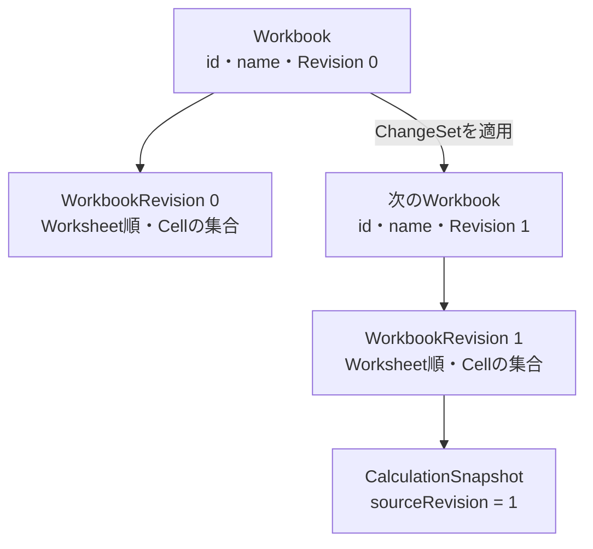

# 1. 入力状態とRevision

## 何を正本にするか

セルには、利用者が入力した内容と、その内容から得られた値があります。

たとえばC4へ`=A4-B4`と入力し、A4が`1200`、B4が`720`なら、次の2つは別のデータです。

| 種類 | C4の内容 | 意味 |
| --- | --- | --- |
| `CellContent` | FormulaSource `=A4-B4` | 利用者が保存した正本 |
| `CellValue` | Number `480` | 正本から導出した結果 |

Gridlineでは、`Cell` Entityに`CellValue`を持たせません。[cell.entity.ts](../../core/domain/entities/cell.entity.ts)が持つのは、位置を示す`CellId`、入力の`CellContent`、最後に変更されたRevisionだけです。

これにより、計算途中の値が保存状態へ混ざらず、計算結果を捨てて再生成できます。この判断は[ADR 0001](../adr/0001-separate-input-and-calculation.md)にも記録されています。

## なぜinputとvalueを同じ可変状態にしないのか

次の形だけでも小さな表は動きます。

```ts
type Cell = {
  input: string;
  value: CellValue;
};
```

しかしA1の変更によってB1、C1を順に再計算している途中では、1つのMapに新旧の値が混ざります。また保存時に`value`まで書き込むと、計算規則を変更したあとも古い値が正本のように残ります。

そこで状態を2つに分けます。

```text
入力側: WorkbookRevision
  「利用者は何を入力したか」

出力側: CalculationSnapshot
  「その入力を現在の計算規則で評価すると何になるか」
```

分離の利点はcacheと同じです。Snapshotが壊れたり古くなったりしても、Revisionがあれば作り直せます。反対に、Revisionを失うとFormulaSourceを復元できません。

## 入力文字列からCellContentへ

[parseCellInput](../../core/domain/value-objects/cell-content.vo.ts)は、UIから受け取った文字列を次の規則で分類します。

| 入力例 | CellContent |
| --- | --- |
| 空文字 | `null`。内容のないCell |
| `=A1+1` | Formula |
| `'001` | Text `001` |
| `TRUE` / `false` | Boolean |
| `12.5` / `1e3` | Number |
| その他 | Text |

構文が壊れた`=1+`もFormulaとして保存します。入力時点で捨てるのではなく、FormulaSourceを残したまま計算結果をParse Errorにするためです。

## Workbook、WorkbookRevision、CalculationSnapshot

似て見える3つの構造は、責務が異なります。

| 構造 | 同一性・対応先 | 含むもの | 保存 |
| --- | --- | --- | --- |
| `Workbook` | 文書の永続的な`WorkbookId` | 名前、現在の完全な`WorkbookRevision` | する |
| `WorkbookRevision` | Workbookの入力版 | Worksheet順、全CellContent | する |
| `CalculationSnapshot` | 1つのRevision | CellValue、Formula解析、依存グラフ、計算Trace | しない |

[workbook-revision.entity.ts](../../core/domain/entities/workbook-revision.entity.ts)は、1回の計算に必要な完全な入力状態です。一方、[calculation-snapshot.derived.ts](../../core/domain/derived/calculation/calculation-snapshot.derived.ts)は`sourceRevision`を持ち、どの入力版から導出されたかを明示します。



同じWorkbookRevisionを明示的に再計算すれば、同じ`sourceRevision`を持つ新しいSnapshotを作れます。SnapshotはWorkbook全体の新しい版ではなく、その版に対応する派生結果です。

## 1回の操作をWorkbookChangeSetにする

セルごとにRevisionを増やすのではなく、1回の利用者操作を[WorkbookChangeSet](../../core/domain/value-objects/workbook-change-set.vo.ts)としてまとめます。

```ts
{
  workbookId,
  baseRevision: 3,
  cellChanges: [
    { cellId: A1, content: 10 },
    { cellId: B1, content: "=A1*2" },
  ],
}
```

複数セルの貼り付けでも、作られる次のRevisionは1つです。この構造には次の不変条件があります。

- 1つ以上のCellChange、変更後のWorksheet Snapshot、または両方を持つ
- 同じCellを1つのChangeSet内で2回変更しない
- 編集を開始した`baseRevision`を持つ

UseCaseの[create-workbook-revision.usecase.ts](../../core/usecases/workbook-revisions/create-workbook-revision.usecase.ts)はRepositoryから現在のWorkbookを読み、Domain ServiceへChangeSetを渡して次のWorkbookを作り、Repositoryへcompare-and-swapで保存します。Revisionの競合判定と生成はDomainの責務で、Repositoryは完成した集約を保存するだけです。

## Worksheetの作成と削除もRevisionを作る

WorkbookRevisionはCellContentだけでなく、Worksheetの集合と順序も含む完全な入力状態です。そのためSheet2を作る操作は、CellChangeを持たない次のChangeSetになります。

```ts
{
  workbookId,
  baseRevision: 3,
  cellChanges: [],
  nextWorksheets: [sheet1, sheet2],
}
```

`nextWorksheets`は「Sheet2をcreateする命令」ではありません。変更後に存在するWorksheetを順番どおりに並べた完全なSnapshotです。削除なら対象を除いたSnapshotを渡します。

```text
Revision 3: [Sheet1]
  + Sheet2
Revision 4: [Sheet1, Sheet2]
  - Sheet1
Revision 5: [Sheet2]
```

この形にすると、作成・削除・将来の並べ替えを別々の動詞として増やさず、「次のRevisionを作る」という1つの操作にまとめられます。またWorksheet削除と、そのWorksheetに属するCellの削除を同じtransactionで確定できます。

ただしCell変更と構造変更ではmerge規則が違います。別々のCellへの古い変更は安全に取り込めますが、古いWorksheet Snapshotを取り込むと、他のClientが追加したSheetを消す可能性があります。そのため`nextWorksheets`を含むChangeSetは、最新Revisionを基にした場合だけ受け入れます。

Workbookは必ず1つ以上のWorksheetを持ちます。最後のWorksheetは削除できません。この不変条件があるため、CellIdが属する場所と、UIが表示する対象を常に1つ以上選べます。

## Cellは疎に保持する

表計算の座標空間は巨大ですが、ほとんどのCellは空です。Gridlineは入力または編集されたCellだけを`Map<CellId, Cell>`へ保持します。

- Mapに存在しないCellの値はBlank
- 一度も編集されていない空CellはMapへ作らない
- 内容を削除したCellも`content: null`と`modifiedRevision`を持つCell EntityとしてMapへ残す
- 計算時は、存在しないCellと`content: null`のCellをどちらもBlankとして扱う

`content: null`のCellは古い編集との競合をDomainで判定するために必要です。それでも未編集の空Cellは生成しないため、計算と保存の量を表全体ではなく、実際に編集されたCell数へ近づけられます。

## この章で押さえること

1. FormulaSourceは入力の正本で、CellValueは派生結果である。
2. WorkbookRevisionは入力状態、CalculationSnapshotは計算状態である。
3. 1回の複数セル操作は1つのWorkbookChangeSetと1つのRevisionになる。
4. Worksheetの集合と順序もWorkbookRevisionの入力状態である。
5. Cell変更はCell単位でmergeできるが、Worksheet構造変更には最新Revisionが必要である。
6. 未編集の空Cellは生成せず、削除済みCellは`content: null`のEntityとして疎に保持する。

次は、FormulaSourceがどのようにTokenとASTへ変換されるかを見ます。
