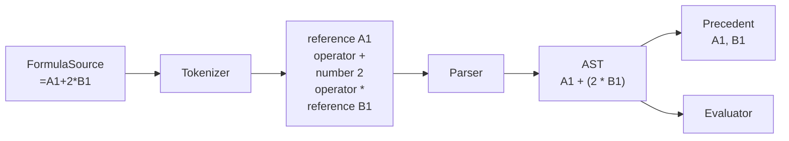

# 2. 数式をデータとして読む

Formulaは文字列のまま直接実行しません。FormulaSourceをTokenへ分解し、構造を持つASTへ変換してから、依存関係の抽出と評価に利用します。



## なぜFormulaSourceをそのまま評価しないのか

`=A1+2*B1`という文字列を、その場で置換・計算するだけでは次の問題を同時に解けません。

- `*`を`+`より先に計算するという文法
- A1とB1がPrecedentだという依存関係
- `SUM(A1:B10)`のRangeという構造
- `$A1`と`A$1`のコピー規則
- 何文字目で構文が壊れたかというError位置
- 未知の関数をJavaScriptの関数呼び出しと混同しない安全な実行

TokenとASTを作ると、同じ構造をDependency抽出、Formula評価、Inspector、Copy & Pasteで共有できます。

```text
文字列を直接扱う設計:
  機能ごとにFormula文字列の解釈を作る

ASTを中心にする設計:
  1回parseした意味構造を各機能が読む
```

Parserは単なる計算前処理ではなく、Formulaという小さな言語の境界です。

## FormulaSourceを保持する

[cell-content.vo.ts](../../core/domain/value-objects/cell-content.vo.ts)の`FormulaSource`は、`=`から始まる文字列です。これはASTに置き換えられる一時データではなく、利用者が入力した正本です。

- 表示と再編集に元の文字列を使える
- 構文エラーがあっても入力を失わない
- Parserを改善したあと、保存済みFormulaを再解釈できる

## Tokenizer

[formula.tokenizer.ts](../../core/domain/value-objects/formula/formula.tokenizer.ts)は先頭の`=`を読み飛ばし、残りをTokenへ分解します。

主なTokenは次のとおりです。

| Token | 例 |
| --- | --- |
| Number | `12.5`, `1e3` |
| Text | `"hello"` |
| Boolean | `TRUE`, `FALSE` |
| Reference | `A1`, `$A1`, `A$1`, `$A$1` |
| Identifier | `SUM` |
| Operator | `+ - * / & = <> < <= > >=` |
| Punctuation | `(`, `)`, `,`, `:` |
| Invalid | 認識できない文字や不完全な参照 |

各Tokenは`start`と`end`を持つため、InspectorはFormulaSource上の位置と対応づけられます。

## Parserと演算子の優先順位

[formula.parser.ts](../../core/domain/value-objects/formula/formula.parser.ts)は、Token列を再帰下降構文解析でASTへ変換します。

優先順位は強い順に次のとおりです。

1. Literal、CellReference、RangeReference、関数呼び出し、括弧
2. 単項`+`、`-`
3. `*`、`/`
4. `+`、`-`
5. 文字列結合`&`
6. 比較`= <> < <= > >=`

したがって、`=A1+2*B1`は次のようなASTになります。

```text
binary "+"
├── reference A1
└── binary "*"
    ├── number 2
    └── reference B1
```

ASTの型は[formula.ast.ts](../../core/domain/value-objects/formula/formula.ast.ts)にあり、Literal、Reference、Range、Unary、Binary、Callのdiscriminated unionです。

## Parse Errorも計算結果の一種

`=1+`のような入力ではParserがErrorを返しますが、FormulaSourceとTokenは保持されます。再計算時に、そのCellのCellValueが`parse` Errorになります。

```text
CellContent: Formula("=1+")       保存される
ParseResult: Error                導出される
CellValue: #PARSE!                導出される
```

例外として処理全体を停止しない点が重要です。表計算では、一部のセルがErrorでも他のセルは表示・計算できなければなりません。

## ASTから依存関係を抽出する

[compile-revision.service.ts](../../core/domain/services/calculation/graph/compile-revision.service.ts)は、全Formula Cellを解析し、ASTを走査してDependencyを抽出します。

- `=A1+B1`から、A1とB1へのCell Dependency
- `=SUM(A1:A1000)`から、A1:A1000へのRange Dependency

Rangeは1000本の辺へ展開せず、範囲の端点を持つsymbolicなDependencyとして保存します。あるCellが変更されたとき、[dependentsOf](../../core/domain/services/calculation/graph/dependency-graph.service.ts)がその座標を含むRangeを検索します。

この方法は巨大Rangeのメモリ使用量を抑えます。現在の実装はRange検索を線形に行うため、Range数が増えたときは空間Indexなどが次の最適化候補です。

## 数式コピーと相対参照

FormulaのReferenceは、座標に加えて行・列それぞれの絶対指定を持ちます。[formula.translator.ts](../../core/domain/value-objects/formula/formula.translator.ts)はコピー元と貼り付け先の差分を、相対部分だけへ適用します。

```text
コピー元: A1
貼り付け先: D3
移動量: 列 +3、行 +2

=A1+$B2+C$3+$D$4
 ↓
=D3+$B4+F$3+$D$4
```

| Reference | 列 | 行 |
| --- | --- | --- |
| `A1` | 移動 | 移動 |
| `$B2` | 固定 | 移動 |
| `C$3` | 移動 | 固定 |
| `$D$4` | 固定 | 固定 |

Translatorは元のToken位置を利用してReference部分だけを書き換えるため、関数名や空白などFormulaSourceの他の部分を再フォーマットしません。

## この章で押さえること

1. FormulaSourceは正本、TokenとASTは再生成可能な派生データである。
2. ASTが演算子の優先順位を明示する。
3. DependencyはASTを走査して抽出する。
4. Rangeは巨大な辺集合にせずsymbolicに保つ。
5. 相対参照と絶対参照はコピー時の座標変換規則である。

次は、Dependencyを使ってDirtyCellと評価順を決めます。
