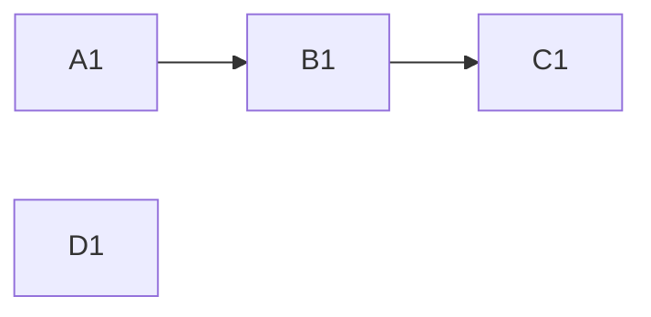
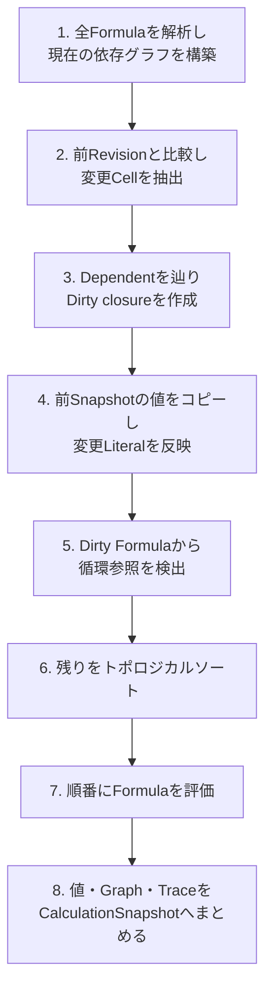

# 3. 依存グラフと再計算

表計算エンジンは、すべてのFormulaを無条件に再評価する必要はありません。変更されたCellと、その値に依存するCellだけをDirtyにし、PrecedentからDependentの順に評価します。

実装の中心は[recalculate.service.ts](../../core/domain/services/calculation/recalculate.service.ts)です。

## 2つの素朴な再計算が失敗する

### 変更されたCellだけを計算する

A1を変更してA1だけ更新すると、A1を参照するB1、そのB1を参照するC1が古いままです。変更Cellだけではなく、推移的なDependentが必要です。

### 毎回すべてを計算する

全Formulaを毎回評価すれば正しくできます。しかし、A1と無関係な100万個のFormulaまで評価すると、編集のたびに待ち時間が発生します。

依存グラフは、この2つの間を取るための構造です。

```text
正しさ: 変更の影響を受けるDependentを漏らさない
速さ:   影響を受けないFormulaのValueを再利用する
```

DirtyCellは「再計算すべき範囲」を表すデータであり、単なる最適化用flagではありません。

## PrecedentとDependent

```text
A1 = 2
B1 = A1 + 1
C1 = B1 * 2
D1 = 10 + 1
```

依存関係は次のようになります。



- B1から見たA1はPrecedent
- A1から見たB1はDependent
- D1はこの依存鎖から独立

A1を変更するとA1、B1、C1がDirtyになりますが、D1は前回の値を再利用できます。

## 再計算の全体手順

`recalculate(revision, previous?)`は、次の順序で1つのCalculationSnapshotを作ります。



### 1. Revisionをcompileする

[compileRevision](../../core/domain/services/calculation/compile-revision.service.ts)は、Revision内の全Formulaをparseし、次を作ります。

- FormulaごとのParseResultとDependency
- CellごとのPrecedent
- 直接参照に対するDependent
- symbolic Rangeに対するDependent

現在は増分compileではなく、Revisionごとに全Formulaを再解析します。

### 2. 変更Cellを見つける

前回のRevisionがある場合、すべてのCellIdの和集合について`CellContent`を比較します。値が同じかではなく、入力が同じかを比較します。

```text
Revision 0: A1 = =1+1
Revision 1: A1 = =2
```

結果がどちらも2でも、FormulaSourceが変わったためA1はDirtyです。

### 3. Dirty closureを作る

変更Cellを始点にDependentを幅優先で辿り、推移的な閉包を取ります。

現在と前回の両方のDependencyGraphを使う点が重要です。Formulaから参照を削除した場合でも、古い依存関係の影響を見落とさず、下流を再計算できます。

### 4. 前回の値を再利用する

増分再計算では、前回のSnapshotのValue Mapを初期値としてコピーします。

- 変更Literalは新しい値へ差し替える
- 削除されたCellの値は消す
- 変更Formulaの古い値は評価前に消す
- DirtyではないCellの値はそのまま再利用する

古いFormula値を先に消すことで、評価に失敗したときも前Revisionの値が漏れません。

## 評価順を決める

Dirty Formulaだけを対象に、Formula同士の依存関係を作ります。Literalはすでに値が確定しているため、トポロジカルソートのNodeにはなりません。

先ほどの例でA1を4へ変更すると、次の状態になります。

| 項目 | Cell |
| --- | --- |
| changed | A1 |
| dirty | A1、B1、C1 |
| evaluationOrder | B1、C1 |
| reused | D1 |

B1を評価して5を得たあと、C1を評価して10を得ます。

## 循環参照

```text
A1 = B1 + 1
B1 = A1 + 1
C1 = A1 + 1
```

Dirty Formulaの有向グラフにTarjanのstrongly connected componentsアルゴリズムを適用します。

- A1とB1は1つのcycle component
- A1とB1には`circular-reference` Errorを設定
- C1はA1のErrorを参照し、そのErrorを伝播

自己参照`A1 = A1 + 1`もcycleです。反復計算は実装していないため、収束を試みずErrorにします。

## Errorは値として伝播する

Errorは例外ではなくCellValueのvariantです。

```text
B1 = 1 / 0       → #DIV/0!、origin B1
C1 = B1 + 1      → #DIV/0!、origin B1
```

C1へ伝播してもoriginをB1のまま保ちます。これにより、InspectorはErrorが表示されたCellだけでなく、最初の発生元を示せます。

対応するErrorは次のとおりです。

| code | 表示 | 例 |
| --- | --- | --- |
| `parse` | `#PARSE!` | `=1+` |
| `type` | `#VALUE!` | `=1+TRUE` |
| `division-by-zero` | `#DIV/0!` | `=1/0` |
| `invalid-reference` | `#REF!` | 型と表示を予約済み。現在のEvaluatorには生成経路なし |
| `circular-reference` | `#CIRC!` | `A1=B1`, `B1=A1` |
| `unknown-function` | `#NAME?` | `=AVERAGE(A1:A2)` |

## CalculationTrace

[calculation-trace.derived.ts](../../core/domain/derived/calculation/calculation-trace.derived.ts)は、計算結果だけでなく「何をしたか」を記録します。

- `dirtyCellIds`
- `evaluationOrder`
- `cycles`

これは正本ではなく、CalculationSnapshotの一部です。右側のInspectorはTraceを表示することで、増分再計算を観察可能にしています。

## 同期処理と非同期境界

現在の`recalculate`は純粋な同期関数です。`CalculationSnapshot`がRevision単位で分離されていることと、計算を非同期・並列に実行することは別の問題です。

将来Workerへ移す場合も、次の契約を維持できます。

```text
入力: WorkbookRevision N
出力: sourceRevision N のCalculationSnapshot
```

計算完了時に、現在のRevisionがまだNかを確認すれば、古い非同期結果を画面へ反映せずに済みます。

## この章で押さえること

1. Dirtyは値の変化ではなく、入力変更とそのDependentで決まる。
2. 前回のValueを再利用しても、Dirty Formulaの古い値は評価前に消す。
3. 循環参照を先に検出し、残りをPrecedent順に評価する。
4. Errorは例外ではなく、発生元を持つCellValueである。
5. CalculationSnapshotは1つのRevisionに対応する整合した派生状態である。
