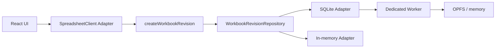
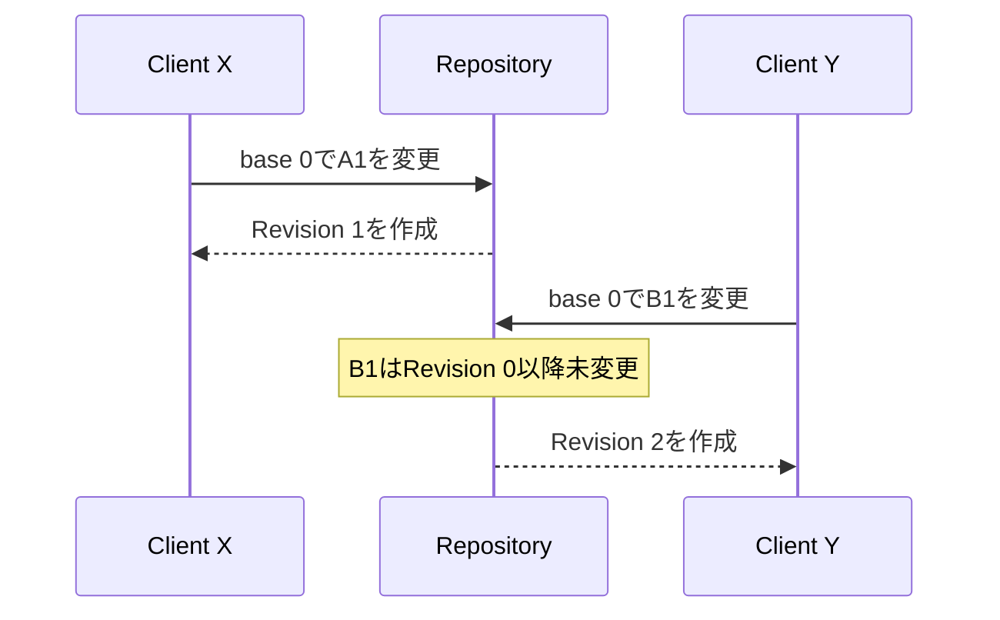
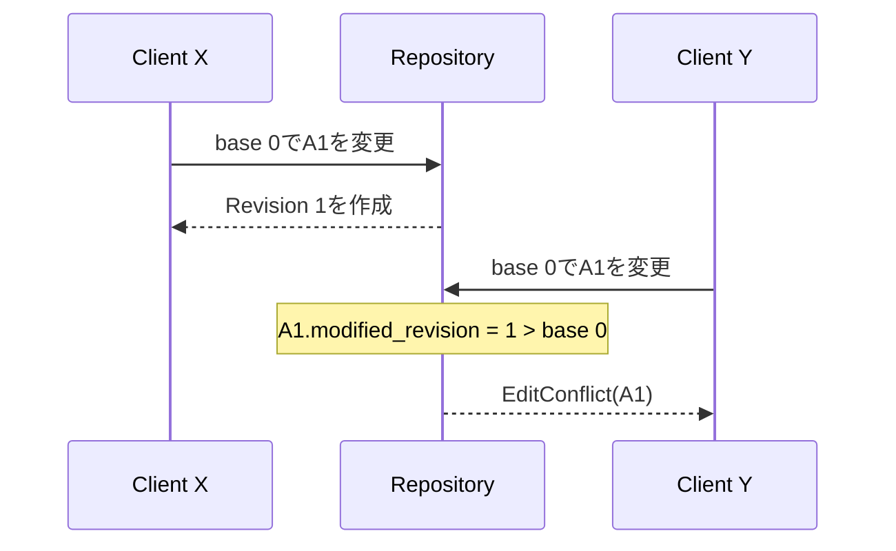

# 4. 永続化と同時編集

計算エンジンが正しい値を返しても、複数セル操作が途中まで保存されたり、古い編集が新しい編集を上書きしたりするとWorkbookは壊れます。この章では、WorkbookChangeSetを原子的に保存し、Cell単位で競合を検出する仕組みを扱います。

## Workbook全体を1つのblobにすると何が起きるか

最初はWorkbookをJSONへ変換し、編集のたびに全体を保存する方法が簡単に見えます。

```text
workbook.json = {
  A1: ...,
  B1: ...,
  ...
}
```

しかしWorkbookが大きくなると、1Cellの変更でも全体を書き直します。さらに2つのClientが同じJSONを読み、別々のCellを編集して保存すると、後から保存したJSONが先の編集を消すlost updateになります。

```text
Client X: 古い全体 + A1変更 ──保存──┐
                                      ├─ 後勝ちで片方を失う
Client Y: 古い全体 + B1変更 ──保存──┘
```

GridlineはWorkbook全体ではなく、変更Cellの集合を保存単位にします。ただしCellを1個ずつ独立保存すると複数セル貼り付けが途中状態になるため、複数のCellChangeを1つのtransactionへまとめます。

つまり保存単位は「Workbook全体」でも「必ず1Cell」でもなく、「1回の利用者操作」です。

## Repository境界

UseCaseはSQLiteへ直接依存せず、[spreadsheet-repositories.port.ts](../../packages/spreadsheet/src/usecases/ports/spreadsheet-repositories.port.ts)のRepository interfaceだけを使います。



Repositoryを交換しても、次の意味は同じです。

- 1つのWorkbookChangeSetから1つの次Revisionを作る
- ChangeSet全体を成功または失敗させる
- 同じCellへの古い編集をEditConflictにする
- 重ならない古い編集は受け入れる

## SQLiteに保存するもの

[sqlite.schema.ts](../../packages/spreadsheet/src/infra/sqlite/sqlite.schema.ts)には3つのTableがあります。

| Table | 役割 |
| --- | --- |
| `workbooks` | WorkbookId、名前、現在のRevision番号 |
| `worksheets` | WorksheetId、名前、表示順 |
| `cell_states` | 座標、CellContent、最後に変更したRevision |

保存しないものは次のとおりです。

- CellValue
- TokenとAST
- DependencyGraph
- CalculationSnapshotとCalculationTrace

これらはWorkbookRevisionから再生成できる派生状態だからです。

## 論理Revisionと物理保存

DomainのWorkbookRevisionは、ある版の完全な入力状態です。ただし現在のSQLite実装はRevision履歴を行単位で保存していません。

```text
論理モデル:
  Revision 0 → Revision 1 → Revision 2

現在の物理モデル:
  workbooks.current_revision = 2
  cell_states = Revision 2を構成する現在のCell状態
```

`modified_revision`は各Cellが最後に変更された版を示し、競合検出に使います。過去版の復元やUndo履歴は現在の範囲外です。

## 原子的なChangeSet

[createWorkbookRevisionInDatabase](../../packages/spreadsheet/src/infra/sqlite/sqlite-workbook.repository.ts)は、1つのSQLite transaction内で次を行います。

1. WorkbookとbaseRevisionを検証する
2. 変更対象Cellの`modified_revision`を調べる
3. 競合があれば何も書かずにEditConflictを返す
4. 競合がなければ変更Cellだけをupsertする
5. `current_revision`を1つ進める
6. 完全な現在Revisionを読み返す

複数セル貼り付けの途中で失敗しても、一部だけ保存されません。

## Cell単位の楽観的競合検出

2つの利用者がRevision 0を開いているとします。

### 重ならない編集



YのbaseRevisionは古いですが、対象のB1は変更されていないため受け入れます。Workbook全体の版が古いだけで拒否すると、無関係な編集まで競合してしまいます。

### 同じCellへの編集



判定規則は次のとおりです。

```text
cell.modifiedRevision > changeSet.baseRevision
```

## 削除とtombstone

CellContentの削除は`content_json = NULL`として保存します。画面やWorkbookRevisionのCell Mapからは消えますが、`modified_revision`を持つ行は残します。

これがtombstoneです。tombstoneがなければ、Revision 2で削除されたA1に対して、Revision 1を基にした古い編集が「A1は存在しないから未変更」と誤判定されてしまいます。

## Dedicated WorkerとOPFS

[browser-repositories.factory.ts](../../packages/spreadsheet/src/infra/sqlite/browser-repositories.factory.ts)はSQLite RepositoryをDedicated Worker上に作ります。Worker境界ではEntity instanceを直接送らず、structured clone可能なDTOを[repository-worker.protocol.ts](../../packages/spreadsheet/src/infra/sqlite/worker/repository-worker.protocol.ts)で交換します。

保存先は利用可能な機能に応じて選ばれます。

1. OPFS SAH pool
2. 通常のOPFS
3. SQLiteのmemory database

WorkerやSQLiteを開始できない場合、Web側の[engine-spreadsheet-client.adapter.ts](../../apps/web/src/infra/engine-spreadsheet-client.adapter.ts)はin-memory Repositoryへfallbackします。

## 再計算との接続

保存と再計算は、次の順番です。

```text
Cell入力
  → WorkbookChangeSetを作成
  → Repository transaction
  → 新しいWorkbookRevisionを取得
  → 前Revisionと前Snapshotを渡してrecalculate
  → 新しいCalculationSnapshotをUIへ投影
```

正本を先に確定し、そのRevisionからSnapshotを作るため、「保存は失敗したが画面の計算値だけ更新された」という状態を避けられます。

## この章で押さえること

1. Repositoryは保存技術ではなく、Revision作成の意味を抽象化する境界である。
2. 複数セル操作は1 transaction、1 WorkbookChangeSet、1 Revisionである。
3. 競合はWorkbook全体ではなく、変更対象Cellの最終変更版で判定する。
4. 削除後の競合検出にはtombstoneが必要である。
5. 保存するのは正本だけで、計算結果は再生成する。
