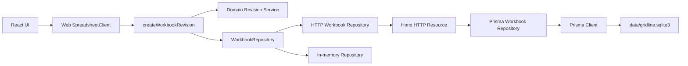
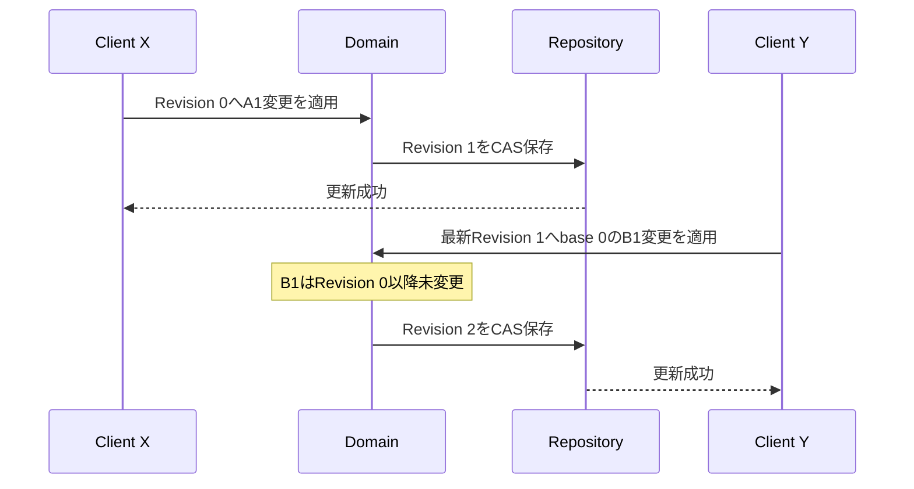
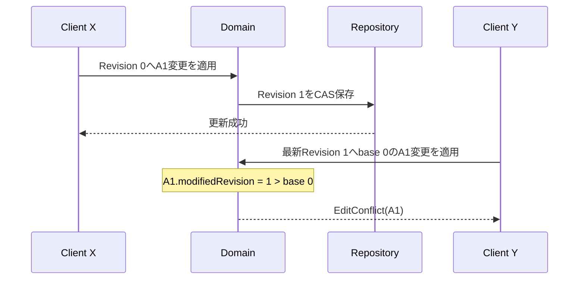

# 4. 永続化と同時編集

計算エンジンが正しい値を返しても、複数セル操作が途中まで保存されたり、古い編集が新しい編集を上書きしたりするとWorkbookは壊れます。この章では、WorkbookChangeSetを原子的に保存し、Cell単位で競合を検出する仕組みを扱います。

## Workbook全体を1つのblobにすると何が起きるか

最初はWorkbookをJSONへ変換し、編集のたびに全体を保存する方法が簡単に見えます。

```text
workbook.json = {
  A1: ...,
  B1: ...,
  ...
}
```

しかしWorkbookが大きくなると、1Cellの変更でも全体を書き直します。さらに2つのClientが同じJSONを読み、別々のCellを編集して保存すると、後から保存したJSONが先の編集を消すlost updateになります。

```text
Client X: 古い全体 + A1変更 ──保存──┐
                                      ├─ 後勝ちで片方を失う
Client Y: 古い全体 + B1変更 ──保存──┘
```

GridlineはWorkbook全体ではなく、変更Cellの集合を保存単位にします。ただしCellを1個ずつ独立保存すると複数セル貼り付けが途中状態になるため、複数のCellChangeを1つのtransactionへまとめます。Worksheet構造を変える場合だけは、変更後の小さなWorksheet一覧を完全な順序付きSnapshotとして同じtransactionへ渡します。

つまり保存単位は「Workbook全体」でも「必ず1Cell」でもなく、「1回の利用者操作」です。

## Repository境界

UseCaseはSQLiteへ直接依存せず、[spreadsheet-repositories.port.ts](../../core/usecases/ports/spreadsheet-repositories.port.ts)のRepository interfaceだけを使います。



次の業務規則はRepositoryではなくDomainにあります。

- 1つのWorkbookChangeSetから1つの次Revisionを作る
- 同じCellへの古い編集をEditConflictにする
- 重ならない古い編集は受け入れる
- Worksheet構造変更は最新Revisionからだけ受け入れる

Repositoryの責務は、完成したWorkbook集約の`create`、`find`、`update`、`delete`です。`update`だけは`expectedRevision`を受け取り、同時更新が先に確定していれば`concurrent-write`を返します。SQLiteのtransactionは集約全体を成功または失敗させますが、ChangeSetの意味は知りません。

## SQLiteに保存するもの

[schema.prisma](../../apps/server/prisma/schema.prisma)には3つのModelがあり、既存のSQLite Table名へ`@@map`で対応づけています。

| Table | 役割 |
| --- | --- |
| `workbooks` | WorkbookId、名前、現在のRevision番号 |
| `worksheets` | WorksheetId、名前、表示順 |
| `cells` | 座標、CellContent、最後に変更したRevision |

保存しないものは次のとおりです。

- CellValue
- TokenとAST
- DependencyGraph
- CalculationSnapshotとCalculationTrace

これらはWorkbookRevisionから再生成できる派生状態だからです。

## 論理Revisionと物理保存

DomainのWorkbookRevisionは、ある版の完全な入力状態です。ただし現在のSQLite実装はRevision履歴を行単位で保存していません。

```text
論理モデル:
  Revision 0 → Revision 1 → Revision 2

現在の物理モデル:
  workbooks.current_revision = 2
  cells = Revision 2を構成する現在のCell状態
```

`modified_revision`は各Cellが最後に変更された版を示し、競合検出に使います。過去版の復元やUndo履歴は現在の範囲外です。

## DomainでRevisionを作り、Repositoryへ原子的に保存する

[create-workbook-revision.usecase.ts](../../core/usecases/workbook-revisions/create-workbook-revision.usecase.ts)は次の順で1操作を処理します。

1. Repositoryから現在のWorkbook集約を読む
2. [create-workbook-revision.service.ts](../../core/domain/services/revision/create-workbook-revision.service.ts)がbaseRevision、Worksheet、Cellの競合を検証する
3. Domainが次の完全なWorkbook集約を生成する
4. Repositoryの`update(nextWorkbook, currentRevision)`でcompare-and-swapする
5. 他の更新が先に確定していたら最新集約を読み直し、元のChangeSetをDomainで再評価する

[prisma-workbook.repository.ts](../../apps/server/src/persistence/prisma/prisma-workbook.repository.ts)は、検証済みの完成した集約をPrismaのinteractive transactionで保存します。`updateMany`の条件へ期待Revisionを含めることでCASを行い、その後のWorksheetとCell更新も同じtransactionに含めます。複数セル貼り付けの途中で失敗しても、一部だけ保存されません。In-memoryや別のDBへ差し替えても、Domainの競合規則は変わりません。

## Cell単位の楽観的競合検出

2つの利用者がRevision 0を開いているとします。

### 重ならない編集



YのbaseRevisionは古いですが、対象のB1は変更されていないため受け入れます。Workbook全体の版が古いだけで拒否すると、無関係な編集まで競合してしまいます。

### 同じCellへの編集



判定規則は次のとおりです。

```text
cell.modifiedRevision > changeSet.baseRevision
```

## 内容を削除したCellもDomain Entityとして残す

CellContentの削除ではCell Entity自体を消さず、`content: null`と更新後の`modifiedRevision`を持たせてWorkbookRevisionのCell Mapへ残します。SQLiteでも`content_json = NULL`の行としてそのまま保存します。

この状態がなければ、Revision 2で内容を削除されたA1に対して、Revision 1を基にした古い編集を「A1は存在しないから未変更」と誤判定します。競合検出に必要な状態を永続化固有のtombstoneへ隠さず、DomainのCellとして明示する設計です。計算結果はBlankになります。

## Worksheet構造の競合はCellとは別に考える

Worksheetの集合と順序は、個別Cellより広いWorkbook構造です。たとえば`[Sheet1, Sheet3]`を持つRevision 3を2つのClientが開き、一方がSheet2を追加し、もう一方が古い一覧からSheet1を削除したとします。

```text
Client X: base 3 → [Sheet1, Sheet3, Sheet2]
Client Y: base 3 → [Sheet3]
```

YのSnapshotを後からそのまま適用すると、Xが作ったSheet2まで消えます。逆に要素ごとの自動mergeは、「削除」と「維持」のどちらが利用者の意図かを判定できません。

そのため、`nextWorksheets`を持つWorkbookChangeSetは次の条件で扱います。

- 変更後の完全な順序付きWorksheet Snapshotとして解釈する
- 1つ以上のWorksheetを必須にする
- ID、名前、順序の重複や欠落を拒否する
- `baseRevision === currentRevision`の場合だけ適用する

一方、`nextWorksheets`を持たないCell変更は、従来どおりCell単位で競合を判定します。構造全体には厳しく、局所的なCell変更には並行性を残す設計です。

Worksheetを削除すると、SQLiteの外部キー`ON DELETE CASCADE`によって所属Cellも同じtransactionで削除されます。削除済みWorksheetへ古いClientがCell変更を送った場合は、そのCellを復活させずEditConflictを返します。

## Node serverと通常のSQLiteファイル

ブラウザはSQLiteへ直接アクセスしません。[http-workbook.repository.ts](../../apps/web/src/persistence/http-workbook.repository.ts)が、Repository interfaceを4つのHTTP resourceへ変換します。

```text
POST   /api/workbooks
GET    /api/workbooks/:workbookId
PUT    /api/workbooks/:workbookId
DELETE /api/workbooks/:workbookId
```

[spreadsheet-http-app.factory.ts](../../apps/server/src/presentation/http/spreadsheet-http-app.factory.ts)はHonoとZodでrequest resourceを検証し、Domain factoryを通してEntity・Value Objectへ復元します。[prisma-client.factory.ts](../../apps/server/src/persistence/prisma/prisma-client.factory.ts)はPrisma ClientとSQLite driverを組み立て、DBをリポジトリ直下の`data/gridline.sqlite3`へ保存します。Prisma recordをDomainとして直接扱わず、[prisma-workbook.codec.ts](../../apps/server/src/persistence/prisma/prisma-workbook.codec.ts)が再度Domain factoryを通してWorkbook集約へ復元します。

```bash
sqlite3 data/gridline.sqlite3
.schema
SELECT * FROM workbooks;
SELECT * FROM worksheets;
SELECT * FROM cells;
```

通常ファイルなので、ブラウザ固有のOPFSやVFSを理解しなくても、保存された正本と`modified_revision`を直接観察できます。serverへ接続できない場合はmemoryへfallbackせず、UIへ接続Errorを返します。永続化されたように見える一時状態を作らないためです。

## 再計算との接続

保存と再計算は、次の順番です。

```text
Cell入力
  → Web境界でCellAddressとCellContentへ変換
  → WorkbookChangeSetを作成
  → UseCaseが現在のWorkbookを取得
  → Domainが次のWorkbookRevisionを生成
  → HTTP PUTとSQLite transactionでCAS保存
  → 前Workbookと前Snapshotを渡してrecalculate
  → 新しいCalculationSnapshotをUIへ投影
```

正本を先に確定し、そのRevisionからSnapshotを作るため、「保存は失敗したが画面の計算値だけ更新された」という状態を避けられます。

## この章で押さえること

1. Revision作成と競合判定はDomain、業務手順はUseCase、RepositoryはCRUDとCASを担当する。
2. 複数セル操作は1 transaction、1 WorkbookChangeSet、1 Revisionである。
3. 競合はWorkbook全体ではなく、変更対象Cellの最終変更版で判定する。
4. Worksheet構造は完全なSnapshotとして、最新Revisionからだけ変更する。
5. 内容を削除したCellも`content: null`のDomain Entityとして残す。
6. Worksheet削除では所属Cellも同じtransactionで削除する。
7. 保存するのは正本だけで、計算結果は再生成する。
8. DBファイルとPrisma schemaはserverが所有し、WebはRepository契約だけを見る。
