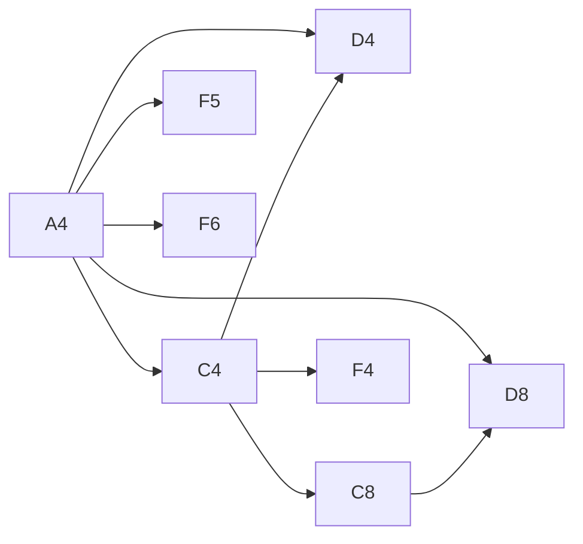

# 5. コードを動かして追跡する

この章では、初期WorkbookのA4を編集したときに、入力が保存・再計算・表示されるまでを追跡します。

## 観察のしかた

操作して結果だけを見るのではなく、毎回次の順番で学びます。

1. 操作前に、changed・dirty・evaluationOrder・CellValueを予測する
2. UIで1回だけ操作する
3. Inspectorで予測と実際のTraceを比較する
4. 予測が外れた箇所だけ、リンク先の関数を読む

コードを上から全部読むより、具体的な状態差分を1つ追うほうが、各構造の必要性を理解しやすくなります。

## 準備

```bash
pnpm dev
```

ブラウザでFormula laboratoryを開きます。初期データは[formula-laboratory.seed.ts](../../apps/web/src/infra/formula-laboratory.seed.ts)にあります。

| Cell | FormulaSourceまたはLiteral | 初期値 |
| --- | --- | --- |
| A4 | `1200` | 1200 |
| B4 | `720` | 720 |
| C4 | `=A4-B4` | 480 |
| D4 | `=C4/A4` | 0.4 |

## A4を1200から1500へ変更する

### 1. PresentationがCellInputを作る

UIはA4と文字列`1500`を[SpreadsheetClient port](../../apps/web/src/usecases/spreadsheet-client.port.ts)へ渡します。複数セル貼り付けの場合も同じ配列に複数のCellInputが入ります。

### 2. AdapterがWorkbookChangeSetを作る

[engine-spreadsheet-client.adapter.ts](../../apps/web/src/infra/engine-spreadsheet-client.adapter.ts)は次を行います。

1. A1表記の`A4`をCellIdへ変換
2. `1500`をNumber LiteralのCellContentへ変換
3. 現在のRevision 0をbaseRevisionにする
4. WorkbookChangeSetを作成

```text
WorkbookChangeSet
├── workbookId: gridline-formula-lab
├── baseRevision: 0
└── cellChanges
    └── gridline-sheet-1!A4 = Number(1500)
```

### 3. RepositoryがRevision 1を作る

WebのHTTP Repositoryは`POST /api/workbook-revisions`でWorkbookChangeSet DTOをserverへ渡します。serverのHTTP resourceがSQLite Repositoryを呼び、SQLite transactionはA4の`modified_revision`を確認します。競合がなければA4を更新してWorkbookの`current_revision`を1へ進めます。

返されるWorkbookRevision 1は、A4だけの差分ではなく、計算に必要な完全な現在入力状態です。

### 4. 再計算がDirtyCellを決める

初期データ全体では、A4から次のCellへ影響が伝わります。



したがって、DirtyCellは次の集合になります。

```text
A4, C4, C8, D4, D8, F4, F5, F6
```

B4、C5、C6など、変更されていないLiteralや無関係なFormulaの値は前Snapshotから再利用します。

### 5. Formulaを依存順に評価する

評価可能になったFormulaから順に計算します。主要な値は次のように変わります。

| Cell | Formula | Revision 0 | Revision 1 |
| --- | --- | --- | --- |
| C4 | `=A4-B4` | 480 | 780 |
| D4 | `=C4/A4` | 0.4 | 0.52 |
| C8 | `=SUM(C4:C6)` | 1440 | 1740 |
| F4 | `=SUM(C4:C6)` | 1440 | 1740 |
| F5 | `=A4*2` | 2400 | 3000 |

`CalculationTrace.evaluationOrder`には、実際に評価したFormula Cellが記録されます。

### 6. SnapshotをViewへ投影する

[spreadsheet-view.projection.ts](../../apps/web/src/infra/spreadsheet-view.projection.ts)は、DomainのEntityやCellValueをReact向けの`WorkbookView`へ変換します。

- CellIdを`A4`形式へ戻す
- CellContentをFormula bar用の入力文字列へ戻す
- CellValueを表示文字列へ変換する
- Workbook全体のTraceとErrorを選択中のWorksheetへ絞って公開する

React componentはDomain EntityやSQLite rowを直接操作しません。

CalculationSnapshot自体はWorkbook全体で1つです。ただしA1という表示だけでは所属Worksheetを区別できないため、Sheet1を表示しているときにSheet2のA1をDirtyCellとして見せません。保存状態や計算状態を分割するのではなく、View境界で表示対象だけを選びます。

## Inspectorで確認する

C4を選択して、次を確認します。

| Inspector項目 | 期待する内容 |
| --- | --- |
| Source | `=A4-B4` |
| Tokens | A4、-、B4 |
| AST | binary `-`、left A4、right B4 |
| Precedents | A4、B4 |
| Dependents | D4、C8やF4へのRange依存の表示 |
| Dirty cells | A4から推移的に影響したCell |
| Evaluation order | Precedentを先にした評価順 |

Inspectorの組み立ては[calculationInspection](../../apps/web/src/infra/spreadsheet-view.projection.ts)にあります。

## 次に試す実験

### WorksheetのRevisionを観察する

下部の`+`からSheet2を作り、A1へ`42`を入力してからSheet1へ戻ります。

1. Sheet2作成でRevisionが1つ進む
2. Sheet2のA1編集でもう1つ進む
3. Sheet1へ切り替えてもRevisionは進まない
4. Sheet2へ戻るとA1の`42`が残る
5. Sheet2を削除するとRevisionが進み、Sheet2のCellも消える
6. 最後に残ったSheet1は削除できない

切替は表示対象の選択であり正本の変更ではありません。作成と削除はWorkbookRevisionを構成するWorksheet構造の変更です。この違いをRevision番号で観察できます。

SQLite CLIを別terminalで開くと、物理状態も確認できます。

```sql
SELECT id, name, position FROM worksheets ORDER BY position;
SELECT worksheet_id, row_number, column_number, content_json FROM cells;
```

Sheet2削除後は、そのWorksheet行と所属Cell行が同じtransactionで消えます。

### Parse Errorを観察する

A10へ`=1+`を入力します。

- FormulaSourceは失われない
- TokenはInspectorに残る
- ASTの代わりにParseErrorが表示される
- CellValueは`#PARSE!`

### Error伝播を観察する

```text
A10 = =1/0
B10 = =A10+1
```

A10とB10はどちらも`#DIV/0!`になりますが、B10のError originはA10です。

### 循環参照を観察する

```text
A10 = =B10+1
B10 = =A10+1
C10 = =A10+1
```

- A10とB10がcycleになる
- A10とB10は`#CIRC!`
- C10へErrorが伝播する
- Inspectorのcycleと評価順を確認する

### 増分再計算を観察する

独立したFormulaを作ります。

```text
A12 = 2
B12 = =A12+1
C12 = =B12*2
E12 = =10+1
```

A12だけを変更し、E12がDirtyにもevaluationOrderにも入らないことを確認します。

### 数式コピーを観察する

C4をC10へコピーします。

```text
=A4-B4  →  =A10-B10
```

次に`=$A4-B$4`を別の位置へコピーし、絶対指定された座標だけが固定されることを確認します。

## コードを読む順番

実験のあと、次の順番で読むとデータの流れを追いやすくなります。

1. [formula-laboratory.seed.ts](../../apps/web/src/infra/formula-laboratory.seed.ts)
2. [engine-spreadsheet-client.adapter.ts](../../apps/web/src/infra/engine-spreadsheet-client.adapter.ts)
3. [workbook-change-set.vo.ts](../../packages/spreadsheet/src/domain/value-objects/workbook-change-set.vo.ts)
4. [create-workbook-revision.usecase.ts](../../packages/spreadsheet/src/usecases/workbook-revisions/create-workbook-revision.usecase.ts)
5. [http-spreadsheet-repositories.adapter.ts](../../packages/spreadsheet/src/infra/http/http-spreadsheet-repositories.adapter.ts)
6. [spreadsheet-http-server.factory.ts](../../apps/server/src/presentation/http/spreadsheet-http-server.factory.ts)
7. [sqlite-workbook.repository.ts](../../packages/spreadsheet/src/infra/sqlite/sqlite-workbook.repository.ts)
8. [node-sqlite.database.ts](../../apps/server/src/infra/sqlite/node-sqlite.database.ts)
9. [compile-revision.service.ts](../../packages/spreadsheet/src/domain/services/calculation/compile-revision.service.ts)
10. [recalculate.service.ts](../../packages/spreadsheet/src/domain/services/calculation/recalculate.service.ts)
11. [spreadsheet-view.projection.ts](../../apps/web/src/infra/spreadsheet-view.projection.ts)

振る舞いの具体例は、[recalculate.service.test.ts](../../packages/spreadsheet/src/domain/services/calculation/recalculate.service.test.ts)、[spreadsheet-server.integration.test.ts](../../apps/server/src/spreadsheet-server.integration.test.ts)、[engine-spreadsheet-client.adapter.test.ts](../../apps/web/src/infra/engine-spreadsheet-client.adapter.test.ts)にもあります。

## 現在サポートしている範囲

- Number、Text、Boolean、Blank、Error
- A1参照と行・列の絶対参照
- RangeReference
- `+ - * / &`
- 比較演算
- 単項`+ -`
- `SUM`
- 相対参照を保つFormulaコピー
- Worksheetの作成・切替・削除
- DirtyCellによる増分Value再計算
- 循環参照とError伝播

未実装なのは、クロスシート参照、日付、配列、`IF`を含む多くの関数、揮発性関数、反復計算、並列評価などです。

## 説明できれば理解できていること

- なぜFormulaSourceとCellValueを同じ状態へ保存しないのか
- なぜCalculationSnapshotがWorkbookRevisionを参照するのか
- PrecedentとDependentの向き
- DirtyCellと「値が変わったCell」の違い
- なぜ循環参照検出後にトポロジカルソートするのか
- なぜ複数セル貼り付けが1つのWorkbookChangeSetなのか
- なぜWorksheet変更は完全な順序付きSnapshotなのか
- なぜCell変更は古いRevisionからmergeできても、Worksheet構造変更はできないのか
- なぜ削除したCellにもtombstoneが必要なのか

ここまで説明できれば、Gridlineのコードだけでなく、表計算エンジンを設計するときの主要な論点を捉えられています。
