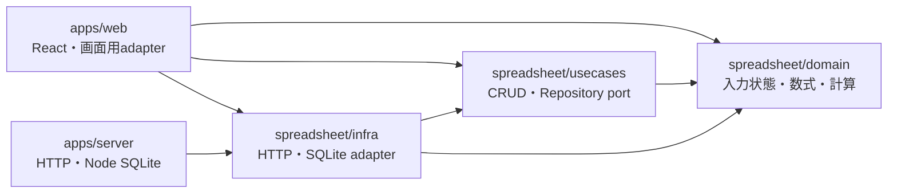
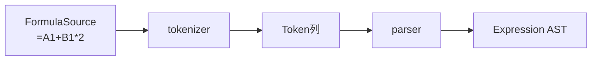
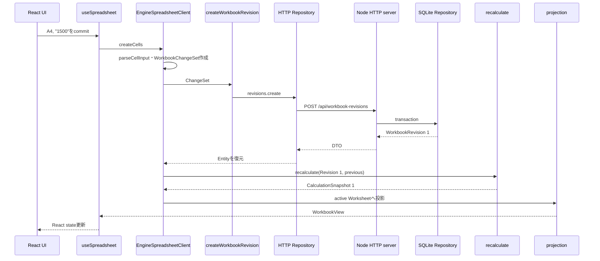

# 6. 実装コードの構造

この章は、Gridlineの概念ではなく、実装コードそのものを理解するための地図です。

「どのディレクトリに何があるか」だけでなく、1回のCell編集がどのファイルを通り、どの状態へ変換されるかまで追跡します。コードを読むときは、個々の関数より先に、次の2本の流れを分けて捉えてください。

```text
保存の流れ:
  利用者の入力 → WorkbookChangeSet → HTTP → SQLite → WorkbookRevision

計算の流れ:
  WorkbookRevision → Formula解析 → DependencyGraph → 再計算 → CalculationSnapshot
```

そもそもGridlineでは、SQLiteへの保存と数式計算は同じ処理ではありません。SQLiteが確定した入力状態を返したあと、Web側の計算エンジンが、その入力から計算結果を導出します。

## リポジトリ全体

```text
my-excel/
├── apps/
│   ├── web/                         React UIと計算runtime
│   └── server/                      HTTP serverとNode SQLite接続
├── packages/
│   └── spreadsheet/                 表計算のDomain・UseCase・Infra
├── docs/
│   ├── adr/                         設計判断
│   └── learning/                    学習ガイド
├── CONTEXT.md                       ドメイン用語集
├── package.json                     workspace全体のcommand
└── pnpm-workspace.yaml              pnpm workspace定義
```

実装の中心は1つのworkspace package、`@gridline/spreadsheet`です。Domain、UseCase、Infraを別packageへ分割せず、1package内のディレクトリとsubpath exportで境界を示します。

[packages/spreadsheet/package.json](../../packages/spreadsheet/package.json)では、次の4つだけをpackage外へ公開しています。

| import先 | 公開するもの | 主な利用者 |
| --- | --- | --- |
| `@gridline/spreadsheet/domain` | Entity、Value Object、Formula、計算service | Webの計算runtime、UseCase、Infra |
| `@gridline/spreadsheet/usecases` | CRUD関数、Repository port | Web adapter、Infra |
| `@gridline/spreadsheet/infra` | HTTP・in-memory adapter | Web |
| `@gridline/spreadsheet/infra/server` | SQLite repositoryとDB protocol | Server |

これによりpackage数は増やさず、import pathを見るだけで依存先の役割が分かります。

## 依存方向

依存は外側から内側へ向きます。



重要なのは、DomainがReact、HTTP、SQLiteを知らないことです。たとえば[recalculate.service.ts](../../packages/spreadsheet/src/domain/services/calculation/recalculate.service.ts)は、`WorkbookRevision`を受け取り`CalculationSnapshot`を返すだけで、保存先も画面も知りません。

反対に`apps/web`はcomposition rootです。Domainの計算、UseCase、HTTP adapter、React UIを組み合わせて、1つのアプリケーションとして動かします。

## `packages/spreadsheet`: 表計算本体

### Domain

```text
packages/spreadsheet/src/domain/
├── entities/
├── value-objects/
│   └── formula/
├── derived/
│   └── calculation/
└── services/
    └── calculation/
```

#### `entities`: 同一性を持つ入力状態

Entityだけをreadonly classとして実装しています。

| Entity | 責務 |
| --- | --- |
| [Workbook](../../packages/spreadsheet/src/domain/entities/workbook.entity.ts) | 永続的なWorkbookId、名前、現在Revision番号 |
| [WorkbookRevision](../../packages/spreadsheet/src/domain/entities/workbook-revision.entity.ts) | ある版のWorksheet順と全CellContent |
| [Worksheet](../../packages/spreadsheet/src/domain/entities/worksheet.entity.ts) | WorksheetIdとWorksheetName |
| [Cell](../../packages/spreadsheet/src/domain/entities/cell.entity.ts) | CellId、CellContent、最後に変更されたRevision |

中心は`WorkbookRevision`です。このEntityは、1回の計算に必要な完全な入力状態を表します。

```text
WorkbookRevision
├── workbookId
├── number
├── worksheets: Worksheet[]
└── cells: Map<CellId, Cell>
```

constructorでは次の不変条件を守ります。

- Worksheetが1つ以上ある
- WorksheetIdとWorksheetNameが重複しない
- Cell Mapのkeyと`Cell.id`が一致する
- 全Cellが、このRevision内に存在するWorksheetへ属する

`WorkbookRevision`には計算後の値がありません。ここにあるのは利用者が入力した`CellContent`だけです。

#### `value-objects`: 値の意味と入力規則

Value Objectはclassにせず、readonly type、branded primitive、factory関数として実装しています。

| ファイル | 主な役割 |
| --- | --- |
| [identifiers.vo.ts](../../packages/spreadsheet/src/domain/value-objects/identifiers.vo.ts) | WorkbookId、WorksheetId、RevisionNumberなど |
| [cell-address.vo.ts](../../packages/spreadsheet/src/domain/value-objects/cell-address.vo.ts) | A1座標、CellId、row・column変換 |
| [cell-content.vo.ts](../../packages/spreadsheet/src/domain/value-objects/cell-content.vo.ts) | 入力文字列をLiteral・Formulaへ分類 |
| [cell-value.vo.ts](../../packages/spreadsheet/src/domain/value-objects/cell-value.vo.ts) | Blank、Number、Text、Boolean、Error |
| [workbook-change-set.vo.ts](../../packages/spreadsheet/src/domain/value-objects/workbook-change-set.vo.ts) | 1回の利用者操作を原子的な変更として表現 |

`CellContent`と`CellValue`は特に重要です。

```text
CellContent                         CellValue
利用者が入力した正本               計算で得た派生結果

Literal(1200)        ────────→     Number(1200)
Formula("=A4-B4")    ────────→     Number(480)
Formula("=1/0")      ────────→     Error(#DIV/0!)
```

入力欄の文字列は[parseCellInput](../../packages/spreadsheet/src/domain/value-objects/cell-content.vo.ts)によって`CellContent | null`へ変換されます。空文字ならCell削除、`=`から始まればFormula、それ以外はNumber・Boolean・Textとして分類されます。

`WorkbookChangeSet`は差分です。複数Cellの貼り付けでも、1回の操作なら1つのChangeSetになります。

```text
WorkbookChangeSet
├── workbookId
├── baseRevision
├── cellChanges[]
└── nextWorksheets?   変更後の完全なWorksheet順
```

Cellは変更分だけを持ちますが、Worksheet構造を変える場合は変更後の完全な順序付きSnapshotを持ちます。

#### `value-objects/formula`: 小さな数式言語

Formulaは次の順番で構造化されます。



| ファイル | 何をしているか |
| --- | --- |
| [formula.tokenizer.ts](../../packages/spreadsheet/src/domain/value-objects/formula/formula.tokenizer.ts) | 文字列をnumber、reference、operatorなどのTokenへ分割 |
| [formula.parser.ts](../../packages/spreadsheet/src/domain/value-objects/formula/formula.parser.ts) | Token列を演算子優先順位に従ってASTへ変換 |
| [formula.ast.ts](../../packages/spreadsheet/src/domain/value-objects/formula/formula.ast.ts) | literal、reference、range、unary、binary、callを型で表現 |
| [formula.translator.ts](../../packages/spreadsheet/src/domain/value-objects/formula/formula.translator.ts) | コピー元と貼り付け先の差から相対参照を移動 |

Parserは再帰下降構文解析です。優先順位を関数の呼び出し順で表しています。

```text
comparison
  └── concatenation
      └── additive
          └── multiplicative
              └── unary
                  └── primary
```

たとえば`=A1+B1*2`は、先に`B1*2`を子nodeにし、その結果をA1と加算するASTになります。

#### `derived/calculation`: 保存しない計算結果

```text
packages/spreadsheet/src/domain/derived/calculation/
├── calculation-snapshot.derived.ts
├── calculation-trace.derived.ts
└── dependency-graph.derived.ts
```

ここには`WorkbookRevision`から導出できる構造だけがあります。

| 構造 | 内容 |
| --- | --- |
| `DependencyGraph` | FormulaごとのPrecedentとDependent |
| `CalculationTrace` | DirtyCell、評価順、循環参照component |
| `CalculationSnapshot` | CellValue、Formula解析結果、Graph、Trace |

これらはSQLiteへ保存しません。計算規則を変更しても、正本である`WorkbookRevision`から作り直せるためです。

#### `services/calculation`: compileと実行

[compile-revision.service.ts](../../packages/spreadsheet/src/domain/services/calculation/compile-revision.service.ts)は、全Formula Cellをparseし、依存関係を構築します。

```text
WorkbookRevision
  → Formula Cellを列挙
  → parseFormula
  → ASTからCellReference・RangeReferenceを抽出
  → precedentsByCell
  → directDependentsByCell / rangeDependents
```

Rangeは範囲内の全座標をedgeへ展開しません。`A1:A1000000`のようなRangeで巨大なedge集合を作らないよう、RangeそのものとDependentの組を保持し、必要なときに座標が範囲内か判定します。

[recalculate.service.ts](../../packages/spreadsheet/src/domain/services/calculation/recalculate.service.ts)は、compile結果を使って値を計算します。処理順は次のとおりです。

1. 前後の`WorkbookRevision`からCellContentが変わったCellを得る
2. 新旧DependencyGraphのDependentを辿りDirty closureを作る
3. Dirty Formula間の隣接関係を作る
4. Tarjan法で強連結成分を求め、循環参照を検出する
5. 循環部分を除き、トポロジカル順序を求める
6. Literalを値へ変換し、FormulaをPrecedentから順に評価する
7. `CalculationSnapshot`と`CalculationTrace`を返す

前回のRevisionとSnapshotが渡された場合、変更されていないCellValueを再利用します。ただしFormula解析とDependencyGraphの構築は、現在はRevisionごとに全Formulaを対象にします。

### UseCases

```text
packages/spreadsheet/src/usecases/
├── workbooks/
├── workbook-revisions/
└── ports/
```

UseCaseは意図的に薄くしています。

| UseCase | 意味 |
| --- | --- |
| [create-workbook.usecase.ts](../../packages/spreadsheet/src/usecases/workbooks/create-workbook.usecase.ts) | Workbookと初期Revisionを作る |
| [find-workbook.usecase.ts](../../packages/spreadsheet/src/usecases/workbooks/find-workbook.usecase.ts) | 現在のWorkbookStateを得る |
| [delete-workbook.usecase.ts](../../packages/spreadsheet/src/usecases/workbooks/delete-workbook.usecase.ts) | Workbookを削除する |
| [create-workbook-revision.usecase.ts](../../packages/spreadsheet/src/usecases/workbook-revisions/create-workbook-revision.usecase.ts) | ChangeSetから次Revisionを作る |

これらはRepository interfaceを呼ぶ関数です。競合検出やtransactionの意味をUseCaseへ複製せず、Repository契約に集約します。

[spreadsheet-repositories.port.ts](../../packages/spreadsheet/src/usecases/ports/spreadsheet-repositories.port.ts)には2つのRepositoryがあります。

```text
WorkbookRepository
├── create
├── find
└── delete

WorkbookRevisionRepository
└── create(changeSet)
```

`WorkbookRevisionRepository.create`の結果は、成功、EditConflict、Workbook不在、baseRevision不在のdiscriminated unionです。例外だけに頼らないため、呼び出し側は失敗の種類をswitchできます。

### Infra

```text
packages/spreadsheet/src/infra/
├── http/
├── repositories/
└── sqlite/
```

#### HTTP adapter

[http-spreadsheet-repositories.adapter.ts](../../packages/spreadsheet/src/infra/http/http-spreadsheet-repositories.adapter.ts)は、Web側で`SpreadsheetRepositories`を実装します。

```text
Repository method
  → EntityをDTOへencode
  → fetch /api/...
  → response DTOをdecode
  → Entityを復元
```

Reactや計算エンジンは`fetch`を直接呼びません。HTTPはRepository interfaceの向こう側に隠れています。

#### SQLite codecとDTO

| ファイル | 境界での役割 |
| --- | --- |
| [sqlite-workbook.dto.ts](../../packages/spreadsheet/src/infra/sqlite/sqlite-workbook.dto.ts) | JSON転送可能なplain data型 |
| [sqlite-workbook.codec.ts](../../packages/spreadsheet/src/infra/sqlite/sqlite-workbook.codec.ts) | Entity・Value ObjectとDTOの相互変換 |
| [sqlite.database.ts](../../packages/spreadsheet/src/infra/sqlite/sqlite.database.ts) | SQLite製品に依存しない最小DB protocolとtransaction helper |
| [sqlite.schema.ts](../../packages/spreadsheet/src/infra/sqlite/sqlite.schema.ts) | `workbooks`、`worksheets`、`cells`のschema |
| [sqlite-workbook.repository.ts](../../packages/spreadsheet/src/infra/sqlite/sqlite-workbook.repository.ts) | SQLによるRepositoryの意味の実装 |

class instanceやbranded typeはJSONでそのまま運ばず、DTOへ落としてHTTP境界を越えます。受信側ではcodecがEntityを再構築し、constructorの不変条件をもう一度通します。

#### SQLite repository

`createWorkbookRevisionInDatabase`は、1つの`BEGIN IMMEDIATE` transaction内で次を行います。

1. ChangeSetの形式とbaseRevisionを検証する
2. Worksheet構造変更なら最新Revisionであることを検証する
3. Cellごとの`modified_revision`を見て競合を検出する
4. Worksheet SnapshotとCell差分を保存する
5. `workbooks.current_revision`を1つ進める
6. 現在の完全なWorkbookRevisionを読み返す

SQLiteは過去のWorkbookRevision全体を保存していません。

```text
Domain上:
  WorkbookRevisionは、ある版の完全な入力状態

SQLite上:
  workbooks.current_revision
  worksheetsの現在行
  cellsの現在行とmodified_revision
```

Cell削除では行を完全に消さず、`content_json = NULL`のtombstoneを残します。これにより、古いClientが削除前のCellを編集しようとしたとき、削除後の変更だと検出できます。Worksheet削除では外部キーの`ON DELETE CASCADE`によって所属Cellを削除します。

#### In-memory repository

[in-memory-repositories.adapter.ts](../../packages/spreadsheet/src/infra/repositories/in-memory-repositories.adapter.ts)は、同じRepository契約をmemory上で実装します。Webの本番fallbackではなく、DomainとWeb adapterのintegration testに使います。

## `apps/server`: 永続化process

```text
apps/server/src/
├── main.ts
├── presentation/http/
└── infra/sqlite/
```

[main.ts](../../apps/server/src/main.ts)は、DB path、hostname、portを決めてHTTP serverを起動するcomposition rootです。標準DB pathは`data/gridline.sqlite3`です。

[spreadsheet-http-server.factory.ts](../../apps/server/src/presentation/http/spreadsheet-http-server.factory.ts)は、Node HTTP requestをRepository関数へ割り当てます。

```text
POST   /api/workbooks
GET    /api/workbooks/:workbookId
DELETE /api/workbooks/:workbookId
POST   /api/workbook-revisions
```

Routeはrequest bodyを読み、SQLite repositoryを呼び、DTOをJSONで返します。数式計算はしません。

[node-sqlite.database.ts](../../apps/server/src/infra/sqlite/node-sqlite.database.ts)はNode組み込みの`DatabaseSync`を、package側の小さな`SqlDatabase` protocolへ適合させます。そのためSQL repositoryはNode固有APIを直接知りません。

## `apps/web`: UIと計算runtime

```text
apps/web/src/
├── main.tsx
├── usecases/
├── infra/
└── presentation/
```

### Web内の境界

[spreadsheet-client.port.ts](../../apps/web/src/usecases/spreadsheet-client.port.ts)は、Reactから見たアプリケーション境界です。

```text
SpreadsheetClient
├── open
├── createWorksheet
├── deleteWorksheet
├── createCells
├── inspect
├── recalculate
└── dispose
```

React componentはDomain Entity、Repository、HTTP DTOを直接扱わず、`WorkbookView`、`CellView`、`CalculationInspection`だけを見ます。

### EngineSpreadsheetClient

[engine-spreadsheet-client.adapter.ts](../../apps/web/src/infra/engine-spreadsheet-client.adapter.ts)が、Web側の中心的なorchestratorです。

このadapterは次の状態を所有します。

```text
ClientLifecycle
├── idle
├── opening
├── ready: CalculatedWorkbookState
└── disposed

CalculatedWorkbookState
├── Workbook
├── WorkbookRevision
└── CalculationSnapshot
```

主な責務は次のとおりです。

- 初回openでSQLiteからWorkbookを探し、なければseedを作る
- 同時に同じseedが作られた場合、作成済みWorkbookを読み直す
- UI入力をCellIdとCellContentへ変換する
- Formulaコピー時に相対参照を変換する
- WorkbookChangeSetを作りUseCaseへ渡す
- 保存済みWorkbookRevisionからCalculationSnapshotを作る
- active Worksheetを選ぶ
- lifecycle外の操作を拒否する

ここが重く見えるのは、保存経路と計算経路を接続するcomposition責務を持つためです。数式の評価規則、SQL、React stateはこのファイルに置かれていません。

### Projection

[spreadsheet-view.projection.ts](../../apps/web/src/infra/spreadsheet-view.projection.ts)は、Domain・計算状態を画面用データへ変換します。

```text
CellId                   → A1
CellContent              → Formula barの文字列
CellValue                → 表示文字列
Formula Token            → Inspector用Token
DependencyGraph          → Precedent・Dependent表示
CalculationTrace         → Dirty・評価順表示
```

`CalculationSnapshot`はWorkbook全体を対象にしますが、画面のA1表記だけではWorksheetを区別できません。そのためprojection時にCell、Trace、Errorをactive Worksheetへ絞ります。

### React stateとcomponent

[use-spreadsheet.hook.ts](../../apps/web/src/presentation/hooks/use-spreadsheet.hook.ts)は、React側の状態遷移をまとめます。

```text
React state
├── workbook: WorkbookView
├── selection
├── inspection
├── isLoading
├── isCalculating
├── error
└── pulse
```

hookは`SpreadsheetClient`を呼び、返されたViewをReact stateへ反映します。非同期のInspector応答には連番を付け、古いrequestが後から返って現在の選択を上書きしないようにしています。

[app.component.tsx](../../apps/web/src/presentation/app.component.tsx)は画面全体を組み立て、状態とcallbackを小さなcomponentへ渡します。

| Component | 表示・操作 |
| --- | --- |
| [spreadsheet-grid.component.tsx](../../apps/web/src/presentation/components/spreadsheet-grid.component.tsx) | Cell格子、選択、編集、clipboard入口 |
| [formula-bar.component.tsx](../../apps/web/src/presentation/components/formula-bar.component.tsx) | 選択Cellの入力編集 |
| [calculation-inspector.component.tsx](../../apps/web/src/presentation/components/calculation-inspector.component.tsx) | Source、Token、AST、依存、Trace、Error |
| [sheet-status-bar.component.tsx](../../apps/web/src/presentation/components/sheet-status-bar.component.tsx) | Worksheet作成・切替・削除、Revision、zoom |
| [workbook-toolbar.component.tsx](../../apps/web/src/presentation/components/workbook-toolbar.component.tsx) | copy、paste、再計算 |

複数選択、copy、pasteの座標計算は`presentation/spreadsheet`以下のutilityへ分離されています。UI componentはpointerやkeyboard eventを受けますが、Formulaの相対参照変換はEngineSpreadsheetClientを通してDomainへ任せます。

## 1回のCell編集を全層で追う

A4を`1200`から`1500`へ変更する場合を追います。



ファイル順では次のようになります。

1. [spreadsheet-grid.component.tsx](../../apps/web/src/presentation/components/spreadsheet-grid.component.tsx)または[formula-bar.component.tsx](../../apps/web/src/presentation/components/formula-bar.component.tsx)
2. [use-spreadsheet.hook.ts](../../apps/web/src/presentation/hooks/use-spreadsheet.hook.ts)
3. [engine-spreadsheet-client.adapter.ts](../../apps/web/src/infra/engine-spreadsheet-client.adapter.ts)
4. [cell-content.vo.ts](../../packages/spreadsheet/src/domain/value-objects/cell-content.vo.ts)
5. [workbook-change-set.vo.ts](../../packages/spreadsheet/src/domain/value-objects/workbook-change-set.vo.ts)
6. [create-workbook-revision.usecase.ts](../../packages/spreadsheet/src/usecases/workbook-revisions/create-workbook-revision.usecase.ts)
7. [http-spreadsheet-repositories.adapter.ts](../../packages/spreadsheet/src/infra/http/http-spreadsheet-repositories.adapter.ts)
8. [spreadsheet-http-server.factory.ts](../../apps/server/src/presentation/http/spreadsheet-http-server.factory.ts)
9. [sqlite-workbook.repository.ts](../../packages/spreadsheet/src/infra/sqlite/sqlite-workbook.repository.ts)
10. [recalculate.service.ts](../../packages/spreadsheet/src/domain/services/calculation/recalculate.service.ts)
11. [spreadsheet-view.projection.ts](../../apps/web/src/infra/spreadsheet-view.projection.ts)
12. [use-spreadsheet.hook.ts](../../apps/web/src/presentation/hooks/use-spreadsheet.hook.ts)へ戻る

この往復の中央にある境界は、次の3つです。

```text
UI境界:          SpreadsheetClient
保存境界:        SpreadsheetRepositories
計算境界:        recalculate(WorkbookRevision) → CalculationSnapshot
```

## 状態はどこにあるか

同じ「状態」でも、置き場所と寿命が異なります。

| 状態 | 所有者 | 永続化 | 作り直せるか |
| --- | --- | --- | --- |
| Workbook identity・現在Revision番号 | SQLite / Workbook | する | できない正本 |
| Worksheet順・CellContent | SQLite / WorkbookRevision | する | できない正本 |
| CellValue・AST・DependencyGraph・Trace | Engine / CalculationSnapshot | しない | Revisionから作り直せる |
| active Worksheet・選択範囲・zoom | Web UI | しない | UI操作で変わる |
| loading・error・pulse | React hook | しない | 一時的なPresentation状態 |

この表を頭に置くと、「この処理はどこへ置くべきか」を判断しやすくなります。

- 入力状態の不変条件ならDomain
- 1回のCRUDの入口ならUseCase
- HTTPやSQLiteへの変換ならInfra
- 保存と計算の接続ならEngineSpreadsheetClient
- 画面向けの形への変換ならProjection
- 選択やloading表示ならReact hook・component

## テスト構造

テストも境界ごとに役割が違います。

| テスト | 保護する範囲 |
| --- | --- |
| [cell-content.vo.test.ts](../../packages/spreadsheet/src/domain/value-objects/cell-content.vo.test.ts) | 入力文字列の分類 |
| [recalculate.service.test.ts](../../packages/spreadsheet/src/domain/services/calculation/recalculate.service.test.ts) | Formula、依存、増分再計算、循環、Error |
| [in-memory-repositories.adapter.test.ts](../../packages/spreadsheet/src/infra/repositories/in-memory-repositories.adapter.test.ts) | Revision作成と競合規則 |
| [sqlite-workbook.codec.test.ts](../../packages/spreadsheet/src/infra/sqlite/sqlite-workbook.codec.test.ts) | EntityとDTOの変換 |
| [engine-spreadsheet-client.adapter.test.ts](../../apps/web/src/infra/engine-spreadsheet-client.adapter.test.ts) | Web adapterからDomain・UseCase・Repositoryまで |
| [spreadsheet-server.integration.test.ts](../../apps/server/src/spreadsheet-server.integration.test.ts) | HTTP server、codec、transaction、実SQLite |
| selection・clipboard utility test | 複数選択とcopy/pasteの座標規則 |

最も広い自動テストはserver integration testです。実際に一時SQLiteファイルとHTTP serverを起動し、閉じて開き直した後も正本が残ることを確認します。React DOM全体のE2Eは現在ありません。

## 目的別の読み順

### 数式が計算される仕組みを読みたい

1. [cell-content.vo.ts](../../packages/spreadsheet/src/domain/value-objects/cell-content.vo.ts)
2. [formula.tokenizer.ts](../../packages/spreadsheet/src/domain/value-objects/formula/formula.tokenizer.ts)
3. [formula.parser.ts](../../packages/spreadsheet/src/domain/value-objects/formula/formula.parser.ts)
4. [formula.ast.ts](../../packages/spreadsheet/src/domain/value-objects/formula/formula.ast.ts)
5. [compile-revision.service.ts](../../packages/spreadsheet/src/domain/services/calculation/compile-revision.service.ts)
6. [recalculate.service.ts](../../packages/spreadsheet/src/domain/services/calculation/recalculate.service.ts)
7. [calculation-snapshot.derived.ts](../../packages/spreadsheet/src/domain/derived/calculation/calculation-snapshot.derived.ts)

### Cell編集が保存される仕組みを読みたい

1. [engine-spreadsheet-client.adapter.ts](../../apps/web/src/infra/engine-spreadsheet-client.adapter.ts)
2. [workbook-change-set.vo.ts](../../packages/spreadsheet/src/domain/value-objects/workbook-change-set.vo.ts)
3. [spreadsheet-repositories.port.ts](../../packages/spreadsheet/src/usecases/ports/spreadsheet-repositories.port.ts)
4. [http-spreadsheet-repositories.adapter.ts](../../packages/spreadsheet/src/infra/http/http-spreadsheet-repositories.adapter.ts)
5. [sqlite-workbook.codec.ts](../../packages/spreadsheet/src/infra/sqlite/sqlite-workbook.codec.ts)
6. [spreadsheet-http-server.factory.ts](../../apps/server/src/presentation/http/spreadsheet-http-server.factory.ts)
7. [sqlite-workbook.repository.ts](../../packages/spreadsheet/src/infra/sqlite/sqlite-workbook.repository.ts)
8. [sqlite.schema.ts](../../packages/spreadsheet/src/infra/sqlite/sqlite.schema.ts)

### UIがDomainから分離されている仕組みを読みたい

1. [spreadsheet-client.port.ts](../../apps/web/src/usecases/spreadsheet-client.port.ts)
2. [engine-spreadsheet-client.adapter.ts](../../apps/web/src/infra/engine-spreadsheet-client.adapter.ts)
3. [spreadsheet-view.projection.ts](../../apps/web/src/infra/spreadsheet-view.projection.ts)
4. [use-spreadsheet.hook.ts](../../apps/web/src/presentation/hooks/use-spreadsheet.hook.ts)
5. [app.component.tsx](../../apps/web/src/presentation/app.component.tsx)

## 読みながら自分へ問うこと

実装を理解できたかは、次の問いにコード上のfileと型を挙げて答えられるかで確認できます。

1. 利用者が入力したFormulaSourceは、どの状態に保存されるか。
2. CellValueがSQLiteへ保存されないのはなぜか。
3. 1回の複数Cell貼り付けは、どこで1つの操作になるか。
4. HTTP境界でEntityがどのようにplain DTOへ変わるか。
5. `modified_revision`はWorkbookRevision全体の保存と何が違うか。
6. FormulaのPrecedentとDependentはどのfileで構築されるか。
7. DirtyCellは「入力が変わったCell」となぜ同じではないか。
8. 循環参照を見つけたあと、なぜ残りにトポロジカルソートが必要か。
9. CalculationSnapshotはWorkbook全体なのに、画面ではなぜactive Worksheetだけに見えるか。
10. `EngineSpreadsheetClient`、`SpreadsheetRepositories`、`recalculate`の3境界は、それぞれ何を隠しているか。

この10問に答えられれば、Gridlineのディレクトリ名を知っているだけでなく、入力・保存・計算・表示の責務がどのようにつながっているかを理解できています。
